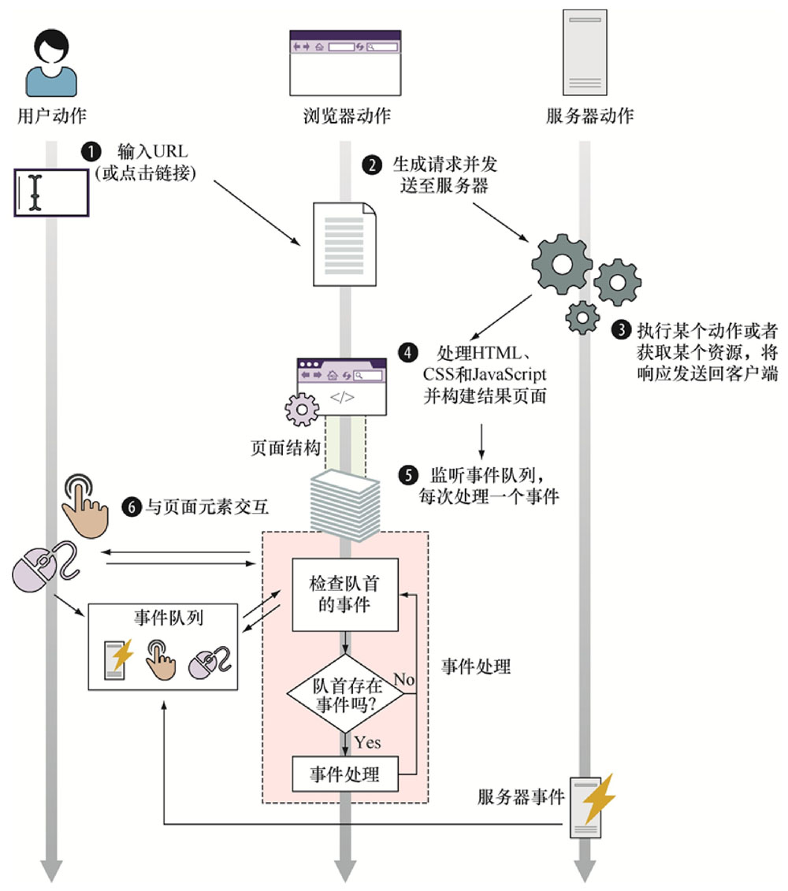
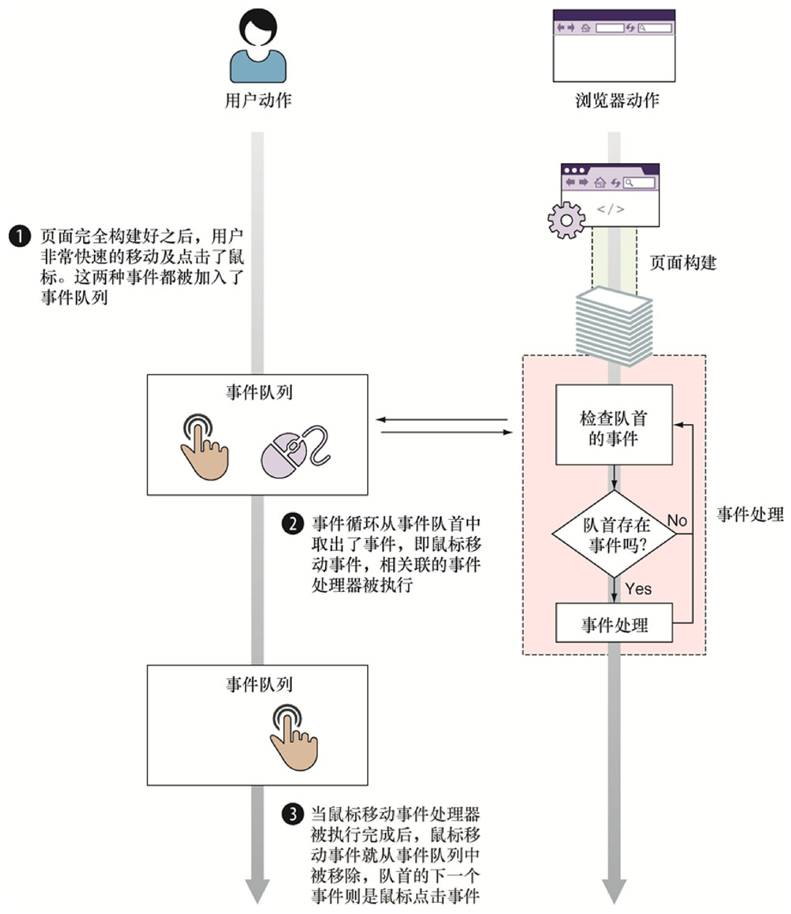

# 第一章 无处不在的 JavaScript

- JavaScript 核心语言特性
- JavaScript 引擎核心要素
- JavaScript 开发中的3个最佳实践


> 能通过下列方式https://kangax.github.io/compat-table/es6/、http://kangax. github. io/compat-table/es2016plus/以及https://kangax.github.io/compat-table/esnext/进行查看，由此保持对浏览器支持状态的了解。


> 最流行的转换编译器是Traceur和Babel。使用如下教程可以很容易地配置它们：https://github.com/googLe/traceur-compiler/wiki/Getting-stanted或http://babeljs.io/docs/setup


#### 性能分析

```js
// 开始计时
 console.time('My operation')

// 执行多次
for(var n=0;n< maxCount;n++){

}
// 停止计时
console.timeEnd("My opertion")
```


### 事件处理器
> 浏览器执行环境的核心思想基于：同一时刻只能执行一个代码片段，即所谓的单线程执行模型。

> 代码的提前建立是问了在之后的某个时间点执行。除了全局代码页面中的大部分代码都将作为某个事件的结果执行


<center>页面构建+事件处理</center>


- 浏览器检查事件队列头
- 如果浏览器没有在队列中检测到事件，则继续检查
- 如果浏览器在队列头中检测到了事件，则取出该事件并执行相应的事件处理器，在这个过程中，余下的事件在事件队列中耐心等待，知道轮到他们被处理


*放置事件的队列是在页面构建阶段和事件处理阶段以外的，这个过程对于决定事件何时发生并将其推入事件队列很重要，这个过程不会参与事件处理线程*

#### 事件是异步的
- 浏览器事件
- 网络事件
- 用户事件
- 计时器事件

#### 注册事件处理器
- 两种方式注册事件
  - 通过把函数赋值给某个特殊属性 `不推荐`
  - 通过使用内置 *addEventListener* 方法

  ```js
  window.onload = function(){}
  ```
  > 缺点：对于某个事件只能注册一个事件处理器

  ```js
  document.body.addEventListener('mousemove',function(){

  })
  ```

  #### 处理事件
  > 当事件发生时，浏览器调用相应的事件处理器。如果签名

  
