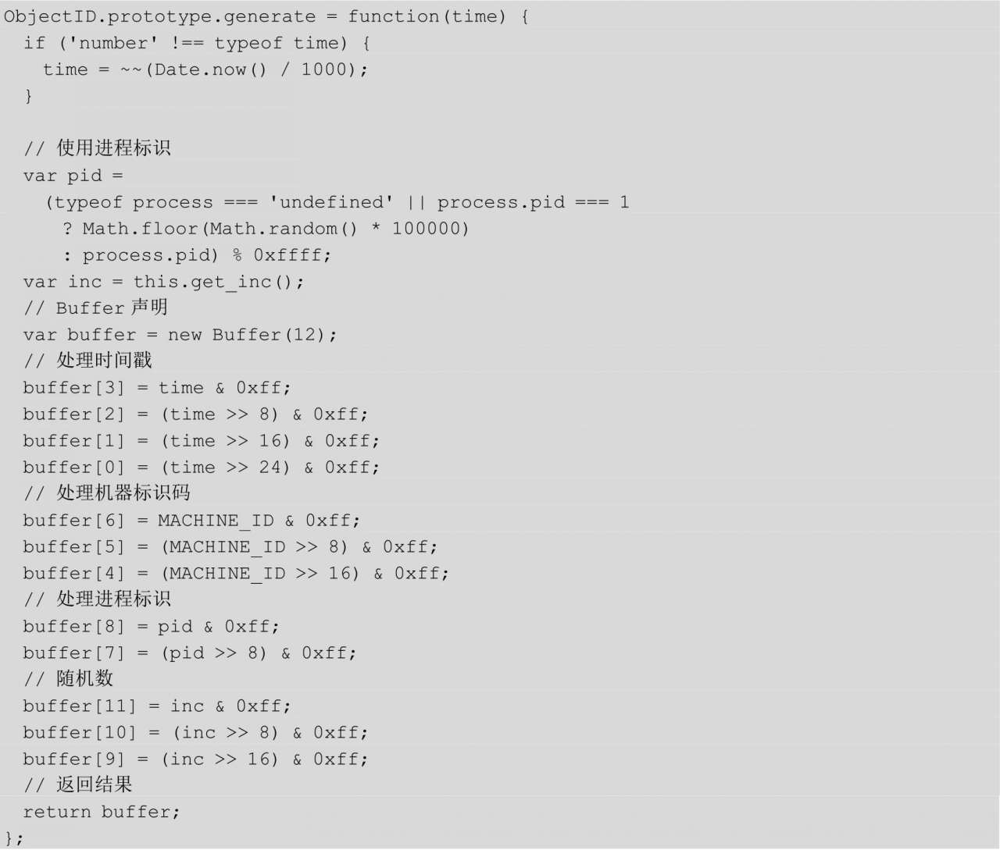
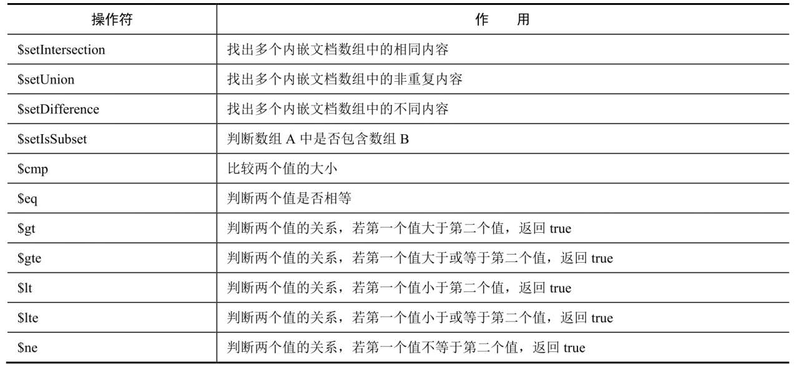

# 中间件

中间件是框架的扩展机制，主要用于抽象HTTP请求过程，在单一请求响应过程中加入中间件，可以更好地应对复杂的业务逻辑。

### ctx 上常用对象
- request req
- response res
- request response 是Koa内置对象
- req 和 res 是在http.createServer 回掉函数里注入的，即未经加工的原生内置对象

```js
 callback(){
     const fn = compose(this.middleware);
     if(!this.listeners('error').length) this.on('error',this.onerror)

     const handleRequest = (req,res)=>{
         res.statusCOde = 404;
         const ctx = this.createContext(req,res)
         const onerror = err=>ctx.onerror(err)
         const handleResponse = ()=> repond(ctx)
         onFinished(res,onerror)
         return fn(ctx).then(handleResponse).catch(onerror)
     }

     return handleRequest;
 }


createContext(req,res){
    const context = Object.create(this.context)
    const request  = context.request = Object.create(this.request)
    const response = context.response = Object.create(this.response)
    context.app = request.app = response.app = this
    context.req = request.req = response.req = req
    context.res = request.res = response.res  = res
    request.ctx = response.ctx = context
    request.response = response
    response.request = request
    context.originalUrl = request.originalUrl = req.url
    context.cookies = new Cookies(req,res,{
        keys:this.keys,
        secure:request.secure
    })
    request.ip = request.ips[0]||req.socket.remoteAddress||''
    context.accept = request.accept = accepts(req)
    const.state = {}
    return context

}

```

## 与浏览器端交互

1. ctx.body
2. ctx.redirect
```js
 // 向后重定向
 ctx.redirect('back')
 ctx.redirect('back','/index.html')
```
3. ctx.render
模版渲染使用的方法

```js
router.get('/',async(ctx,next)=>{
    await ctx.render('index',{
        title:'Hello koa 2'
    })
})
```

## 洋葱模型
1. compose

```js
 compose(middleware){
     return function(context,next){
         let index = -1
         return dispatch(0)
         function dispatch(i){
             if(i<=index)
             return Promise.reject(new Error('next() called multiple times'))
             index = i
             const fn = middleware[i]||next
             if(!fn) return Promise.resolve()
             try{
                 return Promise.resolve(fn(context,function next(){
                     return dispatch(i+1)
                 }))
             }catch(err){
                 return Promise.reject(err)
             }
         }
     }
 }
```

## 常用中间件

### 3类
- Pre-Request: 通常用来改写请求的原始数据
- Request/Response：大部分中间件都在这里，功能各异
- Post-Response: 进行全局异常处理，改写响应数据等

- koa-compress 是实现gzip压缩的中间件
- koa-conditional-get 和 koa-etag 是提供Etag使用的中间件
- koa-favicon是简单的Favicon中间件
- koa-static 是提供静态HTTP资源托管的中间件

## Koa-router
- route
- trie-router
- joi-router
- koa-router express 风格路由

### koa-router 路由风格
- Express风格路由
- 支持HTTp状态码
- 支持多个路由中间件
- 支持多路由
- 支持嵌套路由
- 支持 async/await 写法

### 路由实现原理

- 定义路由
- 路由的路径会被转译成正则表达式
- 匹配请求，使用中间件进行处理

路由解析是核心，使用的是 path-to-regexp模块

- 普通路由
- 具名路由
  ctx.params

- 正则路由 /^\/commit\/ (\w+) (?:\.\.(\w+))?$/
- 嵌套路由

### 路由也是中间件
- 解藕代码，将代码拆分更细致
- 实现模块化，通过组装中间件完成逻辑
- 实现权限类，日志类的AOP
- 实现与Hook 类似的抽象

### HTTP 动词
RESTful 风格路由
```js
router.get 查
router.pose 创建
router.patch 更新
router.delete 删除
```


## 核心要点
 
 http 模块是Node.js 中应用最广且最具代表性的模块， stream 和 EventEmiter 都是服务器端编程领域的经典技术。
 - HTTP 是 Web 应用开发的基础，我们要对协议及其应用场景有深入理解。
 - EventEmiter 主要负责事件监听和处理，异步处理结合事件驱动可以获得更好的性能和易用性
 - Stream 将请求响应过程抽象成一个流并在内存中传递，便于进行大文件处理，能够提高扩展性。

 ### Stream

 #### 5种流程操作类型
  
  - Readable 可读操作类型，可以产出数据，这些数据可以被传送到其他流种，只需要 pipe 方法
  - Writeable: 可写操作类型，只能流进不能流出
  - Duplex 可读可写操作类型
  - Transform 转换类型，可写入数据，然后读出结果
  - classic 经典接口，不怎么使用了

  - Stream 的精髓是将上一个输出作为下一个输入，

  #### HTTP 代理
  #### EventEmitter

### HTTPS
 HTTPS 是以安全为目标的HTTP 通道，简单讲是 HTTP的安全版本，在网络传输过程中，主要使用 SSL/TLS进行加密

 - SSL 安全套接字 位于可靠的面向连接的网络协议层和应用协议层。 通过互相认证，使用数字签名确保完整性，使用加密确保私密性，以实现客户端和服务端的通信安全。由两部分组成，SSL记录协议和SSL握手协议
 - TLS 安全传输层协议，用于保证两个应用程序之间的保密性和数据完整性。由两部分组成 TLS记录协议和TLS握手协议组成

 HTTPS 涉及3个主体
 - 客户端
 - 服务器端
 - 证书颁发


 ### Koa lib/request.js 中由30个方法
 - headers
 - url
 - originUrl
 - href
 - method
 - path
 - query
 - querystring
 - search
 - host
 - hostname
 - fresh
 - stale
 - idempotent
 - socket
 - charset
 - content length
 - accepts
 - acceptsEncodings
 - acceptsCharsets
 - acceptsLanguages
 - type
 - protocol
 - secure
 - ips
 - subdomains
 - is
 - get 
 - inspect
 - toJSON


 ### http 头部
 - charset 获取字符集
 - length 获取Content-Length长度
 - accepts 表示客户端可接受的媒体类型
 - acceptsEncodings 表示支持的压缩算法
 - acceptsCharsets 表示支持的字符集
 - acceptsLanguages 表示支持的语言
 - is 用于判断请求重的Content_Type值与预期是否一致
 - type 用于获取或者设置Content-type


### cookie 的重要属性
- name=value 在Cooie中可以用这种方法对内容赋值
- max=age 最大失效时间 ms
- signed Cookie 值签名
- path 影响到的路径，路径不匹配就不发送
- domain 影响到的域名
- secure true 时 HTTP 中无效，在HTTPS 中才有效 
- httpOnly 微软做的扩展，防止XSS攻击
- Expires 缓存失效时间

### 获取不同参数
- params 具名参数
- query 查询字符串
- body 请求体 POST 类请求才有值

- 请求体 
 - JSON
 - Raw
 - 文本
 - URL-encoded 格式

## 数据库基础
### Node.js Web 编程的4个核心
- 异步流程控制
- Web框架
- 数据库
- 模版引擎

### MongoDB & Mongoose

#### 分关系型数据库用于解决的问题
- 数据的高并发读/写
- 数据的高可用
- 海量数据的存储
- 实时分析

|术语/概念|SQL|MongoDB|
|:-:|:-:|:-:|
|数据库|Database|Database|
|表|Table|Collection|
|行|Row|Document 或 BSON Document|
|列|Column|Field|
|索引|Index|Index|
|表关联|Table joins|$lookup 或内嵌 Documdent|
|主键|Primary Key| Primary Key 默认_id|
|聚合运算|Aggregation|Aggregation Pipeline|

#### MVC （Model View Controller）模型
> 业务逻辑，数据，与界面显示分离的方法来组织代码，将业务逻辑聚合到一个控制器里，可以改进界面及用户交互，进行个性化定制，而且不需要重新编写业务逻辑

##### 模型分类
- 贫血模型
> 把逻辑和数据分离到不同对象。只有状态的对象就是贫血对象 Value Object
- 充血模型
> 属于面向对象编程，有更丰富的语义，更合理的组织，更强的可维护性

### 安装部署MongoDB
- 复制集群`推荐`
- 分片集群

#### macOS 安装
```sh
# 更新brew
 brew update

# 安装 MongoDB
 // brew install mongodb

 brew tap mongodb/brew

## 新建 data文件
 sudo mkdir -p /data/db

# 设置 data文件权限 
 sudo chown -R 'whoami' /data/db

#运行MongoDB 
 mongo
```

### Ubuntu 安装
``` sh
 sudo apt-key adv --keyserver hkp://keyserver.ubuntu.com:80 --rece EA312927

 echo "deb http://repo.mongodb.org/apt/ubuntu.trusty/mongodb-org/3.2 multiverse" | sudo tee /etc/apt/sources.list.d/mongodb-org-3.2.list

 sudo apt-gt update
 sudo apt-get install =y mongodb-org

 sudo service mongod start

```

```sh
db.users.find().limit(pageSize)
//记下last——id
last_id = ...
users = db.users.fins({'_id'>last_id}).limit(10).sort({_id:-1})
// 更新last_id
last_id = 。。。
```

### ObjectID 的组成

_id 是 ObjectID 类型数据，由12字节组成，具有唯一性，前4字节（time）3个字节机器表示码（machine） 2个字节进程标识（pid）最后三个字节是自增计数器




```sh
db.orders.aggregate([
    {
        $group:{
            _id:{
                cust_id:"$cust_id",
                ord_date:{
                    month:{
                        $month:"$ord_date"
                    },
                    day:{
                        $dayOfMonth:"$ord_date"
                    },
                    year:{
                        $year:"$ord_date"
                    }
                },
                total:{$sum:"$price"}
            }
        }
    }
])


```

操作符




### 事物

指单个逻辑工作单元执行的一系列操作，这些操作要么全部执行，要么全部不执行；

ACID

- 原子性 Automicity
- 一致性 Consistency
- 隔离性 Isolation
- 持久性 Durability

#### MongoDB 中处理事物

- 二阶段提交法
- 回滚操作


### 性能调优

通过 `profile` 定位到慢查下，再通过 explain 找到原因，进而调整相关集合设置

profile 的4种设置项

- 0:不开启
- 1: 记录慢查询，默认将耗时大于100 ms 的查询定义为慢查询
- 2： 记录所有查询结果
- 3: 查询采样记录

#### 开启profile 命令

```sh
// 1
db.setProfilingLevel(2,20)

//2 1 表示追踪级别，100 表示慢查询判定时间（ms）
mongod --profile 1 --slowms100
```

#### 查看是否开启
```sh
 db['system.profile'].find()
```


### explain

性能盘查工具

#### db.colection.explain()
#### cursor.explain()

### 索引优化

### 索引类型
- 唯一索引 unique
- 稀疏索引 sparse
- 多值索引 multikey

#### 创建索引

```js
 db.collectionName.ensureIndex()
```
 例1. 在users 集合的name字段创建索引

 ```js
 // 1 生序索引 -1 降序索引
 db.users.ensureIndex({"name":'1'})
 ``` 

 例2. 创建普通符合索引

 ```js
 db.users.ensureIndex({'name':1,'age':1})
 ```

 例3、 创建唯一索引

 确保集合里每个文档制定的键都有唯一值。

 ```js
  db.dept.ensureIndex({'name':1},{'unique':true})
 ```

例4、创建符合唯一索引

单个键的值可以相同，但是所有键的组合值必须是唯一的。

```js
db.users.ensureIndex({'name':1,'age':1},{'unique':true})
```

例5、创建唯一索引时去除重复的值
dropDups 出现重复的值只有第一个值会被保留,dropDups 会强制创建唯一索引，谨慎使用

```js
 db.dept.ensureIndex({'name':1},{unique:true,dropDups:true}})
```
例6、创建稀疏索引

唯一索引会把 null 看作一个值，所以无法将缺少键的多文档插入建立了唯一索引的集合中。某些情况下，我们希望唯一索引仅对包含相应键的文档起作用。
如果又一个字段存在也可能不存在，那边希望字段存在时就是唯一索引，不存在不理会，这时可以将 unique 和 sparse 组合使用

```js
 db.sparse.ensureIndex({"x":1},{'unique':true,'sparse':true})
```

稀疏索引不必是唯一的，去掉unique 就可以创建一个非唯一的稀疏索引

#### Mongoose 中的索引类型

```js
var mongoose = reuqire('mongoose')
mongoose.$schema.indexTypes.forEach(index=>{
    console.log(idnex)
}) 

// 2d 符合索引
// 2dsphere 地理空间索引
// hashed 哈希索引
// text 文本索引
```

1、_id 索引（default_id idnex）
  所有的MongoDB 都有默认的 _id 索引，一个 ObjectID的值

```js
 # 查询 articles 集合的索引
 db.articles.getIndexes()
 # 添加 title 字段索引，并且索引为升序的，如果索引是降序值为 -1
 db.articles.ensureIndex({title:1})
 # 重构索引
 db。articels.reIndex()

```

2、单字段索引 (single field index)
3、多键复合索引 (multikey compound index)
4、复合索引（compound index）
```js
db.products.ensureIndex({"item":1,stock:1})
```
5、地理空间索引（geospatial index）

```js
db.places.ensureIndex({loc:'2dsphere'})
```

6、哈希索引（hashed index）
```js
db.user_scores.ensureIndex({score:'hashed'})
```

7、文本索引（text index）

#### Mongoose 索引定义

```js
 ContactSchema = new Schema({
     owner:{
         type:Schema.ObjectId,
         required:true,
         idnex:true
     }
 })

 // 给属性增加索引
 ContactSchema.ensureIndexs(owner)
```

### MongoDB的链接问题

#### 服务器假死

1、查看 sockstat 状态
 
 ```sh
 cat /proc/net/sockstat
  
  sysct1 -a|grep net.ipv4.tcp_mem

  netstat-an
 ```

 - 找到 close_wait 原因
 - 考虑能否增加tcp_mem的值

 2、使用 ulimit 设置能打开的文件的最大数目

 linux 系统默认打开的文件数是 1024 而实际生产环境这个值太小，系统会报"too many open files" 错误然后崩溃

 ```sh
 ulimit -a 
 ## 查看最大打开文件数量
 ulimit -n
 ```

 3、 查看链接数

 ```sh
 db.runCommand({serverStatus:1}).connections
 ```

 4、链接池

使用Mongoose 内置的链接池可以复用数据库链接，避免大量创建/关闭链接 节省开销
```js
 options = {
     server:{
         auto_reconnect:true, // 自动重连
         poolSize:10 // 链接池大小
     }
 }
```

5、其他原因

- Node.js 应用自身出现异常且没有被捕获，导致进程重启
- 启动 Node.js 进程时由于使用 pm2 作为进程管理器，当进程崩溃后 pm2 默认自动重启 ，会多次重启
- 若 pm2 启动 m 个应用，每个应用启动 n 个 Node.js 进程,这样就会有 mxn个 Node.js 进程，容易崩溃
```shell
pm2 ls
```

定时重启 MongoDB

```sh
 sudo service mongod restart
```


### MongooseDao 

### 异步流程

```js
//使用 Node.js 自带的 Promise 库
Mongoose.Promise = global.Promise
```


## 前端视图模版


- 静态资源托管的方式
- 动态模版渲染：使用模版渲染，结合数据库返回内容，进行动态渲染
- 前后端分离实践
### 静态服务器

#### public 目录
Koa 里有一个 koa-static 模块，是官方提供的静态服务模块，

#### 静态服务

##### Hexo
Hexo 是一个非常好的用于静态网站生成的 Node.js 模块

Hexo 用途
- 编写个人博客
- 编写项目文档
- 编写 demo

##### Surge

##### docsify (vue)

##### Gatsby (React)


### 模块打包器

- Browserify
- Webpack
- Rollup
