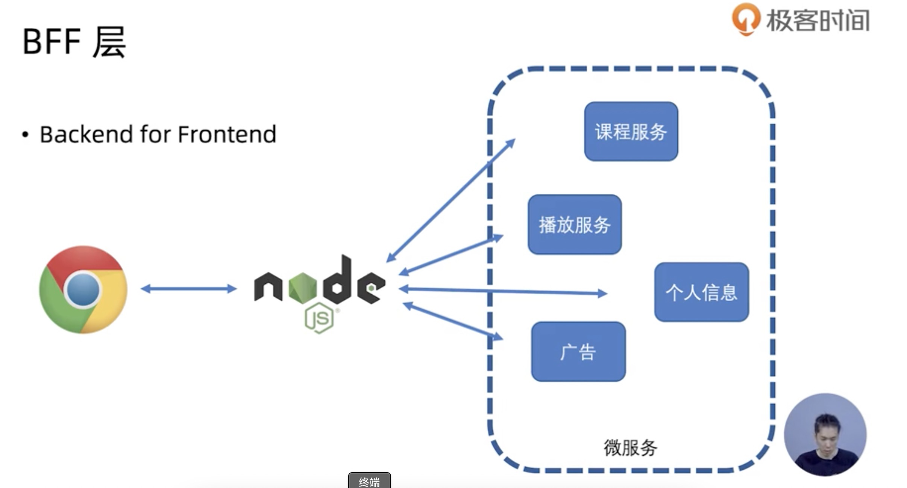

## NODE 实战
1. 什么是 Node.js ?
Node.js 是一个基于 Chrome V8 引擎的 JavaScript 运行环境，它使用了一个事件驱动、非阻塞式 I/O 模型，轻量又高效。

2. Node.js 中运行的 JavaScript 与 Chrome 中运行的 JavaScript 有什么不同？
几乎没有不一样。不一样的点：1. Node.js 中没有浏览器 API, 例如 document, window. 2. Node.js 中有自己的 API.

## 第二章 技术预研
- BFE
  

- npm 大神
 - tjholowaychuk
 - Mafintosh
 - Dominictarr  

 ### 非阻塞I/O
 > I/O 即Input / Output 一个系统的输入输出
 > 阻塞IO 和非阻塞IO 的区别在于系统接受输入再到输出期间，能不能接收其他输入

 食堂排队打饭 VS 饭店点菜

 ### 异步编程 -- callback
 - 回调函数是规范
   - error-first callback
   - node-style callback

   - 每一个事件循环都是一个全新的调用栈

- 第一个参数是error 后面参数才是结果   

### Promise 
- 当前事件循环得不到的结果，但未来的事件循环会给你结果
- 是个状态机
  - pending
  - fulfilled / resolved
  - rejected

  - 执行then catch回返回一个新的promise，该promise最终状态根据 then catch 的回调函数的执行结果确定
    - 如果回调函数最终是 throw 该promise 最终是 rejected状态
    - 如果回调函数最终是 return 该promise 最终是 resolved状态
    - 但是如果最终return 了一个Promise 该promise 的状态会和回调函数return 的promise状态一致
