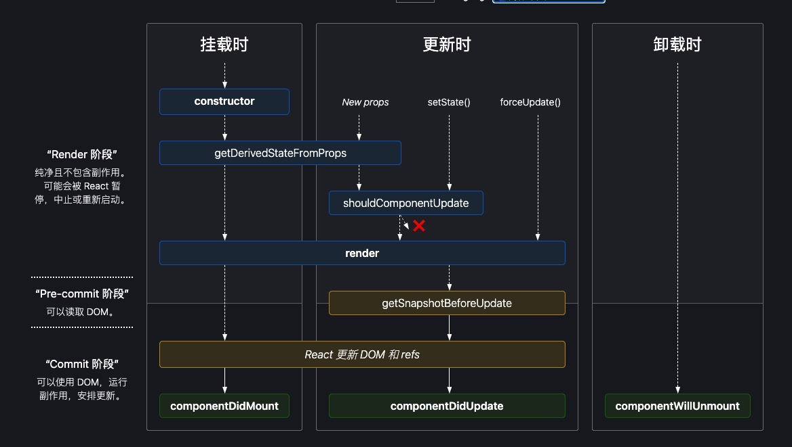
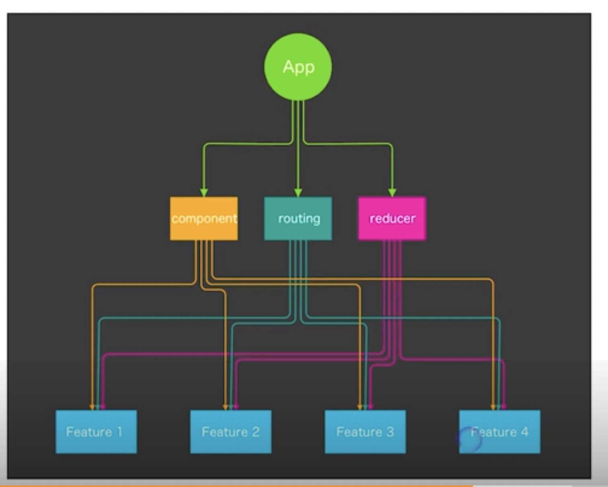

# React

- [Gitee仓库](https://gitee.com/geektime-geekbang/react-geek-time)
- [React文档](https://zh-hans.reactjs.org/docs/getting-started.html)
- [源码](https://codesandbox.io/s/6n20nrzlxz)

## 理解React组件
> props + state = view

- 1. React 组件一般不提供方法，而是某种状态机
- 2. React 组件可以理解为一个纯函数
- 3. 单向数据绑定

## 受控组件 VS 非受控组件
- 受控组件 表单元素状态由使用者维护
- 表单元素状态DOM 自身维护

## 创建组件的原则
### 单一职责 原则
1. 每个组件只做一件事
2. 如果组件变得复杂，那么应该拆开成小组件

## 数据状态管理原则： DRY 原则
1. 能计算得到的状态就不要单独存储
2. 组件尽量无状态，所需数据通过 props 获取

## JSX: 不是模版语言，只是一种语法糖
- 在JavaScript 代码中直接写HTML标记

### 在 JSX 中使用表达式
1. JSX 本身也是表达式 
```js
 const element = <h1>Hello world</h1>
```

2. 在属性中使用表达式
```js
<MyComponent foo={1+2+3+4}/>
```

3.延展属性
```js
 const props = {firstName:'Ben', lastName:'Hecotr'}
 const greeting = <Greeting {...props}/>
```

4. 表达式作为子元素

```js
const element = <li>{props.message}</li>
```

### JSX 优点
1. 声明式创建界面的直观
2. 代码动态创建界面的灵活
3. 无需学习新模版语言

### JSX 约定：自定义组件以大写字母开头
1. React 认为小写的tag 是原生的DOM 节点 如 div
2. 大写字母开头为自定义组件
3. JSX 标记可以直接使用属性语法 如：<menu.item/>

## React 生命周期和使用场景

[来源](https://projects.wojtekmaj.pl/react-lifecycle-methods-diagram/)

### 一、constructor
 1. 用于初始化内部状态，很少使用
 2. 唯一可以直接修改 state 的地方


### 二、getDerviedStateFromProps
1. 当 state 需要从 props 初始化时使用
2. 尽量不要使用：维护两者状态一致性会增加复杂度
3. 每次 render 都会调用
4. 典型场景： 表单控件获取默认值

### 三、componentDidMount
1. UI 渲染完成后调用
2.  只执行一次
3. 典型场景：获取外部资源

### 四、componentWillUnmount
 1. 组件移除时被调用
 2. 典型场景: 资源释放

 ### 五、getSnapshotBeforeUpdate
 1. 在页面render前调用 ， state 已更新
 2. 典型场景：获取 render 之前的 DOM 状态

 ### 六、componentDidUpdate

 1. 每次UI 更新时调用
 2. 典型场景： 页面需要根据 props 变化重新获取数据

 ### 七、shouldComponentUpdate
 1. 决定 VirtualDOM 是否重新重绘
 2. 一般可以由 PureComponent 自动实现
 3.典型场景：性能优化


 ## 理解Virtual DOM 的工作原理，理解Key属性的作用

 ### JSX 的运行基础:Virtual DOM
算法复杂度为 O(n)
#### 虚拟DOM 的两个假设
1. 组件的DOM 结构是相对稳定的
2. 类型相同的兄弟节点可以被唯一标识 KEY


## 组件的设计模式： 高阶组件和函数作为子组件
### 高阶组件（HOC）
```js
const EnhancedComponent = higherOrderComponent(WrappedComponent)
```
高阶组件接受组件作为参数，返回新的组件

### 函数作为子组件

```js
class MyComponent extends React.Component {
    render(){
        return (
            <div>
                {this.props.children('Nate Wang)}
            </div>
        )
    }
}

<MyComponent>
{
    (name)=>{
        <div>{name}</div>
    }
}
</MyComponent>
```

## 08 理解 ContextAPI 的使用场景 组件间通信 （16.3 新特性）

```js
 const ThemeContext = React.createContext('light')
 class App extends React.Component{
     render(){
         return (
             <ThemeContext.Provider value="dark">
             <ThemeButton/>
             </ThemeContext.Provider>
         )
     }
 }

 function ThemeButton(props) {
     return (
         <ThemeContext.Consumer>
            {theme=><Button {...props} theme={theme}>}
         </ThemeContext.Consumer>
     )
 }
```

## 09. 使用脚手架创建 React 应用

1. Create React App

2. CodeSandbox

3. Rekit

## 10 打包部署

### 为什么需要打包
1. 编译 ES6 语法特性，编译 JSX
2. 整合资源，例如图片 Less/Sass
3. 优化代码体积

### 打包注意事项
1. 设置nodejs 环境为 production
2. 禁用开发时专用代码 比如 logger
3. 设置应用根路径


## 11、 Redux

### Redux特性：

1. Sing Source of Truth
2. 可预测性 state + action = new state
3. 纯函数更新 store

## 12. Redux Store Action Reducer

### Stroe
```js
const store = createStore(reducer)
```
1. getState()
2. dispatch(action)
3. subscribe(listener)

### action 
描述行为的数据结构

## reducer （state,action）=> new sate 
接受 state 和action的函数 返回 state

## combineReducers

```js
 export default function todos(state=[], action) {
     switch(action.type) {
         case 'ADD_TODO':
             return state.concat([action.text])
        default:
            return state
     }
 }

 export default function conter(state = 0, action) {
     switch(action.type){
         case:'INCREMENT':
           return state + 1
         case:'DECREMENT':
           return state -1
         default:
             return state    
     }
 }

 // 封装多个reducer
 import {combineReducers} from 'redux'
 import todos from './todos'
 import counter from './counter'
 export default combineReducders({
     todos,
     counter
 })
```

## bindActionCreators

```js

function addTodoWithDispatch(text) {
    const action = {
        type:ADD_TODO,
        text
    }
    dispatch(action)
    // dispatch(con)
}

dispatch(addTodo(text))

const boundAddTodo = text => dispatch(addTodo(text))

addTodo = bindActionCreators(addTodo, store.dispatch)

```

## 13. React 中使用 Redux
```js
// 把组件 connect 到组件上
import {connect} from 'react-redux'

class SidePanel extends Component{

}
function mapStatetoProps(state) {
    return {
        nextgen:state.nextgen,
        router:state.router,
    }
}
function mapDispatchToProps(dispatch) {
    return {
        actions:bindActionCreates({...actions},dispatch)
    }
}

export default connect(mapStateToProps,mapDispatchToProps)(SidePanel)
```

### connect 工作原理：高阶组件

## 14. Redux 异步Action, Redux 中间件
1.异步action 不是特殊 action,而是多个同步action的组合使用

### Middleware 中间件 在dispatcher 中截获action 做特殊处理
1.截获action
2.发出action

## 15. 如何组织Action 和 Reducer

### 官方形式 Redux Action 问题
1. 所有Action 放在一个文件里，会无限扩展
2. Action Reducer 分开，实现业务逻辑时需要来回切换
3. 系统中有哪些Action 不够直观

## 新的方式:每个文件一个Action
1.易于开发：不用在 action 和 reducer 文件来回切换
2. 易于维护： 每个action 文件都很小，容易理解
3. 易于测试： 每个业务逻辑只需要对应一个测试文件
4. 易于理解：文件名就是Action名字，文件列表就是action列表
```js
// counterPlusOne.js
import {
    COUNTER_PLUS_ONE
} from './constants';

export function counterPlusOne(){
    return {
        type: COUNTER_PLUS_ONE
    }
}

export function reducer(state, action) {
    switch(action.type) {
        case COUNTER_PLUS_ONE:
            return {
                ...state,
                count:state.count+1
            };
        default: return state;    
    }
}
```

## 16. 理解不可变数据（Immutability）
### 为何需要不可变数据
1. 性能优化
2. 易于调试和跟踪
3. 易于推测

### 如何操作不可变数据
1. 原生写法 {} , Object.assign
```js
const state ={ filter:'completed', todos:['learn React']}

const newState = {...state, todos:[...state.todos,'Learn Redux']}

const newState2 = Object.asign({}, state, {todos:[...state.todos,'Learn Redux']})
```

2. immutability-helper

```js
 import update from 'immutability-helper'

 const state = {filter:'completed', todos:['Learn React']}

 const newState = update(state, {todos:{$push:['learn Redux']}})
```

3. immer

```js
import produce from 'immer'

const state = {filter:'completed', todo:['Learn React']}

const newState = produce(state, draftState => {
    draftState.todos.push('Learn Redux.')
})
```

## 17. React Router: 路由不只是页面切换，更是代码组织方式
### 为什么需要路由
1. 单页面应用需要进行页面切换
2. 通过URL可以定位到页面
3. 更有语义的组织资源

### React Router 的特性
1.声明式路由
2.动态路由

### 路由三种实现方式
1. URL路径
2. hash 路由
3. 内存路由

### 基于路由配置进行资源组织

1. 实现业务逻辑的松耦合
2. 易于扩展，重构和维护
3. 路由层面实现LazyLoad

### React Router API
 1.<Link> 普通链接，不会出发浏览器刷新
 2. <NavLink> 类似Link 但是会添加当前选中状态
 3. <Prompt> 满足条件时提示用户是否离开当前页面
 4.<Redirect> 重定向当前页面，例如登录判断
 5.<Route> 路由配置核心标记，路径匹配时显示对应组件
 6. <Switch> 只显示第一个匹配的路由

 ## 18. React Router 参数定义，嵌套路由的使用场景

 ### 通过URL传递参数

 1. 如何通过URL 传递参数<Route path="/topic/:id" .../>
 2. 如何获取参数 this.props.match.params
 3. https://github.com/pillarjs/path-to-regexp

 #### 何时需要URL参数
 - 页面状态尽量通过URL参数定义

 ### 嵌套路由
 1. 每个 React 组件都可以是路由容器
 2. React Router 的声明式语法可以方便的定义嵌套路由

 ## 19. UI组件库对比和介绍 Ant.Design、Material UI 、Semantic UI

 ### 选择UI库的考虑因素
 1. 组件库是否齐全
 2. 样式风格是否符合业务需求
 3. API 设计十分便捷和灵活
 4. 技术支持是否完善
 5. 开发示范活跃

 ## 20 使用 Next.js 创建 React 同构应用/服务端渲染

 ### 什么是 Next.js
 一个用于生产环境的React框架

 1. 页面就是pages 目录下的一个组件
 2. satic 目录映射静态文件
 3. page 具有特殊静态方法 getInitialProps

 ### 在页面中使用其它 React 组件

 1. 页面也是标准的 node 模块，可以使用其它 React 组件
 2. 页面会针对性打包，仅包含其引入的组件

 ### 使用Link 实现同构路由
 1. 使用 next/link 定义链接
 2.点击链接时页面不会刷新
 3.使用prefetch 预加载目标资源
 4.使用replace 属性替换URL

 ## 21. 使用 Jest Enzyme 等工具进行单元测试
 ### React 让前端单元测试变得容易

 1. React 应用很少需要访问浏览器API
 2. 虚拟DOM可以在NodeJs 环境运行和测试
 3. Redux 隔离了状态管理，纯数据层单元测试

 ### 单元测试涉及的工具
 1. Jest Facebook 开源的 JS 单元测试框架
 2. JS DOM 浏览器环境的 Node.js 模拟
 3. Enzyme： React 组件渲染和测试（airbnb）
 4. nock 模拟 HTTP 请求
 5. sinon函数模拟和调用跟踪
 6. istanbul 单元测试覆盖率

 ## 22. 常用开发调试工具， EsLint Prettier, React DevTool , Redux DevTool
 ### ESLint
 1. 使用 .eslintrc进行规则配置
 2. 使用 airbnb 的 JavaScript 代码风格

### Prettier
1. 代码格式化神器
2. 保证更容易写出风格一致的代码

# 第三章 创建可维护可扩展的前端应用

## 23. 前端项目的理想架构：可维护、可扩展、可测试、易开发、易构建

### 易于开发
1. 开发工具是否完善
2. 生态圈是否繁荣
3. 社区是否活跃

### 易扩展

1. 增加新功能是否容易
2. 新功能是否会显著增加系统复杂度

### 易于维护
1. 代码是否容易理解
2. 文档是否健全

### 易于测试
1. 功能分层是否清晰
2. 副作用少
3. 尽量使用纯函数

### 易于构建
1. 使用通用技术架构
2. 构建工具的选择

## 24. 拆分复杂度：按领域模型（feature） 组织代码，降低耦合度

### 常见的问题
1. 项目初期 规模小，模块关系清晰
2. 项目逐渐复杂，添加了更多组件和其它元素，
3. 项目收尾： 文件结构、模块依赖错综复杂

### 解决方式
1. 将业务逻辑拆分成高内聚松耦合的模块
2. 通过React 技术栈实现


## 25. 拆分复杂度：如何组织 component、 action、reducder

### 文件夹结构
1.按feature 组织源文件
2.组件和样式文件同一级
3. Redux 单独文件夹
4. 单元测试保持同样目录结构放在 tests 文件夹

使用root loader 加载 feature下的各个资源

做到高内聚松耦合


## 26. 拆分复杂度：如何组织 React Router 的路由配置
1. 在每个feature 中单独定义自己的路由
2. 使用JSON 定义顶层路由

## 27. 使用Rekit: 创建项目，代码生成和重构

- Rekit：https://github.com/supnate/rekit
```sh
 npm install -g rekit
 rekit create react-app
 cd react-app
 npm install
 npm start

 npm i -g rekit-studio
 rekit-studio -p 3020
```


极客时间版权所有: https://time.geekbang.org/course/detail/100009301-11282?utm_term=pc_interstitial_1266
## 28. 使用Rekit 遵循最佳实践，保持代码一致性


## 第四章 常见场景的最佳实践
## 29. 使用ReactRouter 管理登录权限

## 使用React Router 管理路由授权
1. 实现基础：React Router 的动态路由机制
2. 区分受保护路由和公开路由
3. 访问未授权路由时重定向到登录页面
