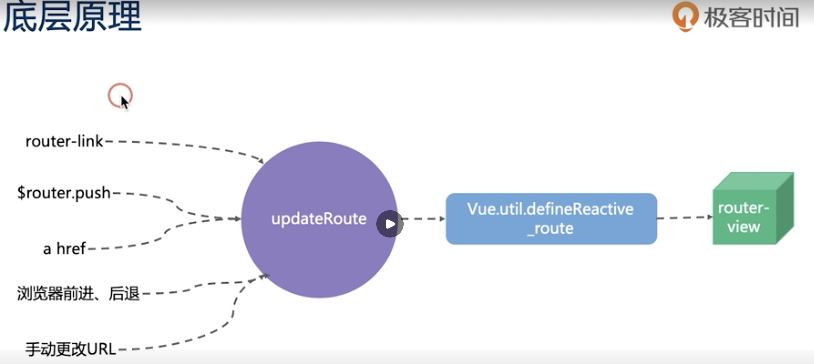
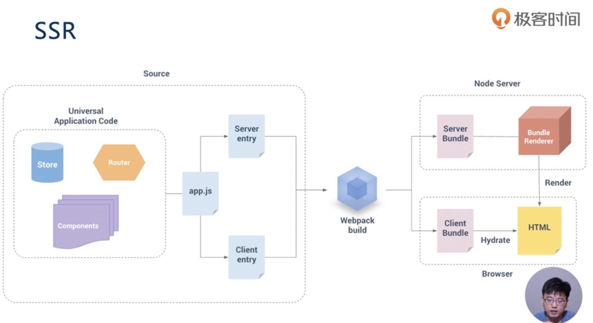
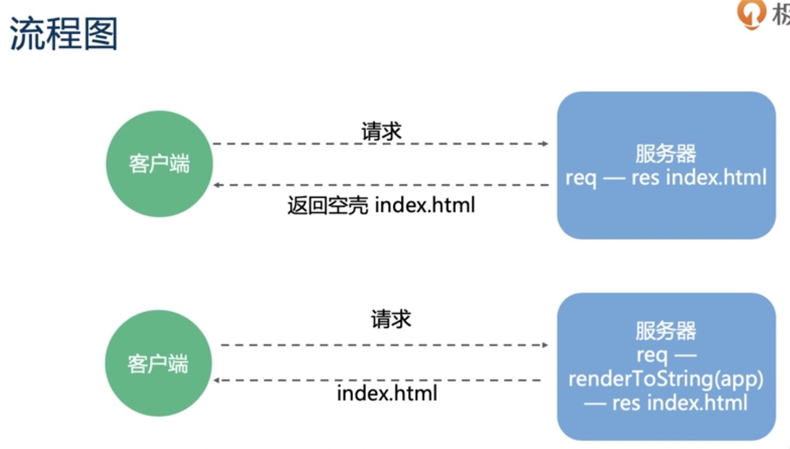
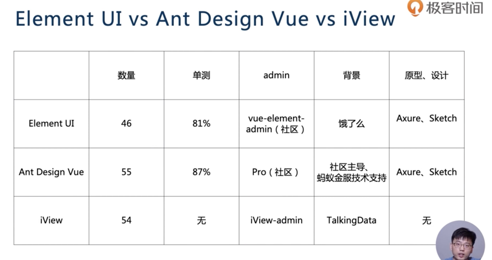

# VUE

## 特点
- 轻量
- 渐进🔟框架
- 响应式更新机制
- 学习成本低

## 概述
- 基础篇 Vue 核心知识点
- 生态篇 大型Vue 项目所需的周边技术
- 实战篇 开发基于Vue 的Ant Design Pro
- 福利篇 Vue3.0 相关知识

## 基础篇
- 模版语法
- 指令

### 组件基础及组件注册

```js
 Vue.component('todo-list',{
            template:`
            <ul>
            <todo-item v-for="item in list" :title="item.title" :del="item.del"/>
            </ul>
            `,
            data:function(){
                return {
                list:[
                {
                    title:'课程1',
                    del:true,
                },
                {
                    title:'课程1',
                    del:true,
                },
                {
                    title:'课程1',
                    del:false,
                }
                ],
                item:{
                    title:'课程1',
                    del:true,
                }
            }
            }
        })
```


### Vue组件核心概念 事件
### 插槽
- 匿名插槽
- 具名插槽
- 作用域插槽  返回组件的函数

### 单文件组件
### 虚拟dom diff 算法 同级别对比 key的作用是节点复用


## 11. 组件的更新 响应式更新
- 任何时候直接都不要直接操作dom
- 数据来源 单向
  1. 来自父元素属性
  2.自身data
  3. 状态管理器

## 12. 计算属性和监听器
### computed
- 减少模版中计算逻辑
- 数据缓存
- 依赖固定的数据类型（响应式数据）

### watch
- 更灵活，通用
- watch 中可以执行任何逻辑，如函数节流，Ajax 异步获取数据，操作DOM

### 区别
- computed 能做的 watch 都能做， 反之不行
- 能用computed 尽量用computed


## 13. 生命周期的应用场景和函数式组件


创建阶段 beforeCreate   cfreated  beforeMount render mounted
更新阶段                          beforeUpdate render updated
销毁阶段                                       beforeDestory  destoryed

### 创建前
 初始化事件和声命周期 -》 beforeCreate 数据观测，属性，监听器配置等 -》 created -> 模版编译到render -》 beforedMount -> render -> mounted -> 异步请求 操作dom定时器等

### 更新阶段（可以多次执行）
依赖数据改变或$forceUpdate 强制刷新 -》 beforeUpdate (移除已经添加的事件监听器等,不要更改依赖数据)
-》 render -》 upated -> 操作dom添加事件监听器等 不可更改依赖数据

### 销毁阶段
beforeDestory -> 移除已经添加的事件监听器，计时器等 -》 destoryed


### 函数试组件
- functional:true
- 无状态，无实例，没有上下文this,无生命周期

## 14.指令的本质是什么
- v-html
- show
- v-text
- v-if
- v-else-if
- v-else
- v-for
- v-bind :
- v-on @
- v-model
- v-pre 原字符串输出 {{this}}
- v-once 只执行一次
- v-cloak 

### 语法糖，标志位

### 自定义指令 directives
- bind
- inserted
- update
- componentUpdated
- unbind


## 15 高级特性 provide(提供)/inject（注入）

```js
// 父组件
privide(){
    return {theme:{
        color:'blue'
    }}
}

// 子组件

inject:{
    theme:{
        from:"theme"// 名字不同时必须
        default:()=>{}
    }
}


```

## 16 如何优雅地获取跨层级组件实例
### ref  引用信息
```js
vm.$refs.p
vm.$refs.child
vm.$refs.parent.child

```

### callback ref
- 主动通知
- 主动获取
```js
// 父组件
provide() {
    return{
        setChildrenRef:(name,ref){
            this[name] = ref
        },
        getChildrenRef:name=>{
            return this[name]
        },
        getRef:()=>{
            return this
        }
    }
}


// 子组件
<ChildrenH v-ant-ref="c=>setChildrenRef('childrenH',c)"
inject:{
    setChildrenRef:{
        default:()=>{}
    }
}
```
[vue-ref](https://www.npmjs.com/package/vue-ref)

## 17 template 和 JAX的对比以及它们的本质
- JSX 更灵活
- template 学习成本低，灵活性低
JSX
```js
export default {
    props:{
        level:{
            type:Number,
            default:1
        }
    },

    render:function(){
        const Tag = `h${this.level}`;
        return <Tag>{this.$slots.default}</Tag>
    }
}
```

函数组件
```js
<template>
  <div class="hello">
    <h1>{{ msg }}</h1>
    <p>
      For a guide and recipes on how to configure / customize this project,<br>
      check out the
      <a href="https://cli.vuejs.org" target="_blank" rel="noopener">vue-cli documentation</a>.
    </p>
    <h3>Installed CLI Plugins</h3>
    <ul>
      <li><a href="https://github.com/vuejs/vue-cli/tree/dev/packages/%40vue/cli-plugin-babel" target="_blank" rel="noopener">babel</a></li>
      <li><a href="https://github.com/vuejs/vue-cli/tree/dev/packages/%40vue/cli-plugin-eslint" target="_blank" rel="noopener">eslint</a></li>
    </ul>
    <h3>Essential Links</h3>
    <ul>
      <li><a href="https://vuejs.org" target="_blank" rel="noopener">Core Docs</a></li>
      <li><a href="https://forum.vuejs.org" target="_blank" rel="noopener">Forum</a></li>
      <li><a href="https://chat.vuejs.org" target="_blank" rel="noopener">Community Chat</a></li>
      <li><a href="https://twitter.com/vuejs" target="_blank" rel="noopener">Twitter</a></li>
      <li><a href="https://news.vuejs.org" target="_blank" rel="noopener">News</a></li>
    </ul>
    <h3>Ecosystem</h3>
    <ul>
      <li><a href="https://router.vuejs.org" target="_blank" rel="noopener">vue-router</a></li>
      <li><a href="https://vuex.vuejs.org" target="_blank" rel="noopener">vuex</a></li>
      <li><a href="https://github.com/vuejs/vue-devtools#vue-devtools" target="_blank" rel="noopener">vue-devtools</a></li>
      <li><a href="https://vue-loader.vuejs.org" target="_blank" rel="noopener">vue-loader</a></li>
      <li><a href="https://github.com/vuejs/awesome-vue" target="_blank" rel="noopener">awesome-vue</a></li>
    </ul>
    <VNodes :vnodes="getAnchoredHeading(4)"></VNodes>
  </div>
</template>

<script>
export default {
  name: 'HelloWorld',
  props: {
    msg: String
  },
  components:{
    VNodes:{
      functional:true,
      render:(h, ctx)=> ctx.props.vnodes
    }
  },
  methods:{
    getAndchoredHeading(level){
      const Tag = `h${level}`
      return <Tag>Hellow World</Tag>
    }
  }
}
</script>
```


## 18 Vuex

VUE dispatch actions（featch data） commit Mountations -> State - render VUE 

Vuex 通过什么方式提供响应式数据？
new Vue()

## 19 如何在VUe中使用 Vuex

$store 是如何挂载到VUe上的？
  计算数学computed 时间getters缓存
  beforeCreate 中混入 $store


## 20vuex 核心概念
- State this.$store.state.xxx 取值 提供响应数据
- Getter this.$store.getter.xxx 取值 借助Vue 的计算属性，computed 来实现缓存
- Mutation - this.$store.commit('xxx',<payload>) 赋值 更改 state
- Action - this.$store.dispatch('xxx',<payload>) 赋值 触发 mutation 方法
- Module Vue.set 动态添加state到响应式数据中

## 21 vuex 最佳实践

- State mapState
- Getter mapGetters
- Mutation mapMutations
- Actions  mapActions
- Moudule

  - 开启命名空间 namespace
  - 嵌套模块不要过深，尽量扁平化
  - 灵活应用 createNamespacedHelpers 辅助生成 map 系列 节省命名空间


## 22 Vue Router

### 单页面开发模式
 - 监听URL 的变化，并在变化前后执行相应的逻辑
 - 不同URL对应不同的组件
 - 提供多种方式修改 URL的API（URL的改变不能导致浏览器刷新）

 ### 使用方式
 - 提供一个路由配置表，不同URL对应不同组件的配置
 - 初始化路由实例 new VueRouter()
 - 挂载到Vue 实例上
 - 提供一个路由占位，用来挂载URL匹配到的组件

 SPA 的缺点有哪些，如何解决

 ## 23路由的模式类型
 - hash 丑，无法使用锚点
 - history 需要服务端配置
 

## 24 Nuxt.js 解决了哪些问题

### 1、SPEA 缺点
- 不利于SEO
- 首屏渲染慢

### 2、解决方案
- 服务端渲染 SSR
  - 动态渲染
  - 配置繁琐
- 预渲染 predrending 
  - 适用于静态站点


### 3、Nuxt

- 静态站点
- 动态渲染
- 简化配置

### 思考 动态内容不使用SSR 如何做SEO

使用无头浏览器


## 25 Nuxt 核心原理


SPA VS SSR



## 26、UI 组件库对比




## 27 提升开发效率和体验的常用工具： Vetur、 ESlint、Prettier、Vue DevTools
- Vetur
  - 语法高亮
  - 标签补全，模版生成
  - Lint 检查
  - 格式化

- ESlint
 - 代码规范
 - 错误检查  

 ```json
 "extends": [
      // "plugin:vue/essential", // 非必需配置
      "plugin:vue/strong-reommnded", // 强烈推荐的配置

      "eslint:recommended"
    ],
```
- Prettier
 - 格式化

## 28 单元测试的重要性和使用方式
- 重要性
 - 保证研发质量
 - 提高项目的稳定性
 - 提高开发速度

- 使用方式
 - jest 或 mocha
 - @vue/test-utils
 - sinon  

### 测试报告实时执行
```sh
 npm run test -- --watchAll
```


## 29、 30、解答

## 31 实战说明

## 32 vue-cli 创建项目

npm i -S ant-design-vue moment

## 33 如何自定义 webpack 和babel配置


## 46 图标
1、 雪碧图
2、 图标
3、 字体
4、 svg


## 优化分析
```sh
npm run build -- --report 
npm run test:unit -- --watch
```

## CI 持续集成
[https://travis-ci.org](https://travis-ci.org)
[https://circleci.com](https://circleci.com)


## 单测覆盖率
[https://codecov.io/](https://codecov.io/)
[https://coveralls.io](https://coveralls.io)

##文档托管
- github.io
- gitee.io
- https://www.netlify.com


## issue 管理
- https://github.com/apps/close-issue-app
- https://vuecomponent.github.io/issue-helper
- https://github.com/dessant/lock-threads


